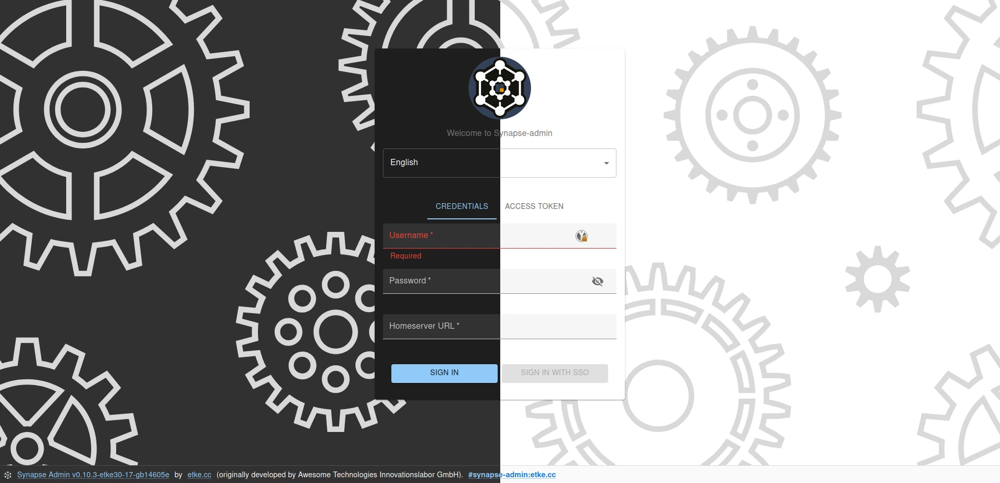

<p align="center">
  
  <h3 align="center">
    Synapse Admin<br>
    <a href="https://matrix.to/#/#synapse-admin:etke.cc">
      
    </a><br>
    <a href="./LICENSE">
      
    </a>
  </h3>
  <p align="center">Feature-packed and visually customizable: A better way to manage your Synapse homeserver.</p>
</p>

---




<!-- vim-markdown-toc GFM -->

* [Fork differences](#fork-differences)
  * [Changes](#changes)
  * [Development](#development)
  * [Support](#support)
* [Configuration](#configuration)
  * [Prefilling login form](#prefilling-login-form)
  * [Restricting available homeserver](#restricting-available-homeserver)
  * [Protecting appservice managed users](#protecting-appservice-managed-users)
  * [Adding custom menu items](#adding-custom-menu-items)
* [Usage](#usage)
  * [Supported Synapse](#supported-synapse)
  * [Prerequisites](#prerequisites)
  * [Use without install](#use-without-install)
  * [Step-By-Step install](#step-by-step-install)
    * [Steps for 1)](#steps-for-1)
    * [Steps for 2)](#steps-for-2)
    * [Steps for 3)](#steps-for-3)
  * [Serving Synapse Admin on a different path](#serving-synapse-admin-on-a-different-path)
* [Development](#development-1)

<!-- vim-markdown-toc -->

## Fork differences

With [Awesome-Technologies/synapse-admin](https://github.com/Awesome-Technologies/synapse-admin) as the upstream,
this fork introduces numerous enhancements to improve usability and extend functionality,
including support for authenticated media, advanced user management options, and visual customization.
The full list is described below in the [Changes](#changes) section.

**Availability**

* As a core/default component on [etke.cc](https://etke.cc/?utm_source=github&utm_medium=readme&utm_campaign=synapse-admin)
* As a standalone app on [admin.etke.cc](https://admin.etke.cc)
* As a prebuilt distribution on [GitHub Releases](https://github.com/etkecc/synapse-admin/releases)
* As a Docker container on [GitHub Container Registry](https://github.com/etkecc/synapse-admin/pkgs/container/synapse-admin)
* As a component in [Matrix-Docker-Ansible-Deploy Playbook](https://github.com/spantaleev/matrix-docker-ansible-deploy/blob/master/docs/configuring-playbook-synapse-admin.md)

### Changes

The following changes are already implemented:

* 🛑 [Prevent admins from deleting themselves](https://github.com/etkecc/synapse-admin/pull/1)
* 🐛 [Fix user's default tab not being shown](https://github.com/etkecc/synapse-admin/pull/8)
* 🔑 [Add identifier when authorizing with password](https://github.com/Awesome-Technologies/synapse-admin/pull/601)
* 🔒 [Add ability to toggle whether to show locked users](https://github.com/Awesome-Technologies/synapse-admin/pull/573)
* 🖊️ [Fix user's display name in header on user's page](https://github.com/etkecc/synapse-admin/pull/9)
* 🧹 [Fix footer overlapping content](https://github.com/Awesome-Technologies/synapse-admin/issues/574)
* 🐋 Switch from nginx to [SWS](https://static-web-server.net/) for serving the app, reducing the size of the Docker image
* 🔄 [Fix redirect URL after user creation](https://github.com/etkecc/synapse-admin/pull/16)
* 🔍 [Display actual Synapse errors](https://github.com/etkecc/synapse-admin/pull/17)
* ⚠️ [Fix base_url being undefined on unsuccessful login](https://github.com/etkecc/synapse-admin/pull/18)
* 📜 [Put the version into manifest.json](https://github.com/Awesome-Technologies/synapse-admin/issues/507) (later replaced with a proper manifest.json generation on build)
* 📊 [Federation page improvements](https://github.com/Awesome-Technologies/synapse-admin/pull/583) (using icons)
* 🚪 [Add UI option to block deleted rooms from being rejoined](https://github.com/etkecc/synapse-admin/pull/26)
* 🛠️ [Fix required fields check on Bulk registration CSV upload](https://github.com/etkecc/synapse-admin/pull/32)
* 🛡️ [Fix requests with invalid MXIDs on Bulk registration](https://github.com/etkecc/synapse-admin/pull/33)
* 🖼️ [Expose user avatar URL field in the UI](https://github.com/etkecc/synapse-admin/pull/27)
* 🚀 [Upgrade react-admin to v5](https://github.com/etkecc/synapse-admin/pull/40)
* 🔒 [Restrict actions on specific users](https://github.com/etkecc/synapse-admin/pull/42)
* 📞 [Add `Contact support` menu item](https://github.com/etkecc/synapse-admin/pull/45)
* 🧹 [Provide options to delete media and redact events on user erase](https://github.com/etkecc/synapse-admin/pull/49)
* 🎞️ [Authenticated Media support](https://github.com/etkecc/synapse-admin/pull/51)
* 👁️ [Better media preview/download](https://github.com/etkecc/synapse-admin/pull/53)
* 🔐 [Login with access token](https://github.com/etkecc/synapse-admin/pull/58)
* 📏 [Fix footer causing vertical scrollbar](https://github.com/etkecc/synapse-admin/pull/60)
* 🍴 [Custom Menu Items](https://github.com/etkecc/synapse-admin/pull/79)
* 🧑‍💻 [Add user profile to the top menu](https://github.com/etkecc/synapse-admin/pull/80)
* 🎨 [Enable visual customization](https://github.com/etkecc/synapse-admin/pull/81)
* 🛋️ [Fix room state events display](https://github.com/etkecc/synapse-admin/pull/100)
* 🧹 [Sanitize CSV on import](https://github.com/etkecc/synapse-admin/pull/101)
* ⚙️ Allow setting version using `SYNAPSE_ADMIN_VERSION` environment variable on build (if git is not available)
* 🧪 [Add option to control user's experimental features](https://github.com/etkecc/synapse-admin/pull/111)
* 🔑 [Add random password generation on user create/edit form](https://github.com/etkecc/synapse-admin/pull/123)
* 🚦 [Add option to set user's rate limits](https://github.com/etkecc/synapse-admin/pull/125)
* 🌐 [Support configuration via /.well-known/matrix/client](https://github.com/etkecc/synapse-admin/pull/126)
* 🛑 [Prevent accidental user overwrites](https://github.com/etkecc/synapse-admin/pull/139)
* 🔍 [Allow providing login form details via GET params](https://github.com/etkecc/synapse-admin/pull/140)
* 🎨 [Add preferred theme colors to login page and footer](https://github.com/etkecc/synapse-admin/pull/155)
* 🔰 [Add "Assign Admin" button to the rooms](https://github.com/etkecc/synapse-admin/pull/156)
* 🖼️ [Add rooms' avatars](https://github.com/etkecc/synapse-admin/pull/158)
* 🤖 [User Badges](https://github.com/etkecc/synapse-admin/pull/160)
* 🔑 [Allow prefilling any fields on the login form via GET params](https://github.com/etkecc/synapse-admin/pull/181)


_the list will be updated as new changes are added_

### Development

`just run-dev` to start the development stack (depending on your system speed, you may want to re-run this command if
   user creation fails)

This command initializes the development environment (local Synapse server and Postgres DB),
and launches the app in a dev mode at `http://localhost:5173`

After that open [http://localhost:5173](http://localhost:5173?username=admin&password=admin&server=http://localhost:8008) in your browser,
login using the following credentials:

* Login: admin
* Password: admin
* Homeserver URL: http://localhost:8008

### Support

If you have any questions or need help, feel free to join the [community room](https://matrix.to/#/#synapse-admin:etke.cc) or create an issue on GitHub.

## Configuration

You can use `config.json` file to configure Synapse Admin instance,
and `/.well-known/matrix/client` file to provide Synapse Admin configuration specifically for your homeserver.
In the latter case, any instance of Synapse Admin will automatically pick up the configuration from the homeserver.
Note that configuration inside the `/.well-known/matrix/client` file should go under the `cc.etke.synapse-admin` key,
and it will override the configuration from the `config.json` file.

In case you use [spantaleev/matrix-docker-ansible-deploy](https://github.com/spantaleev/matrix-docker-ansible-deploy) or
[etkecc/ansible](https://github.com/etkecc/ansible),
configuration will be automatically added to the `/.well-known/matrix/client` file.

[Configuration options](./docs/config.md)

The `config.json` can be injected into a Docker container using a bind mount.

```yml
services:
  synapse-admin:
    ...
    volumes:
      ./config.json:/app/config.json:ro
    ...
```

### Prefilling login form

You can prefill all fields on the login page using GET parameters.

[Documentation](./docs/prefill-login-form.md)


### Restricting available homeserver

You can restrict the homeserver(s), so that the user can no longer define it himself.

[Documentation](./docs/restrict-hs.md)

### Protecting appservice managed users

To avoid accidental adjustments of appservice-managed users (e.g., puppets created by a bridge) and breaking the bridge,
you can specify the list of MXIDs (regexp) that should be prohibited from any changes, except display name and avatar.

[Documentation](./docs/system-users.md)

### Adding custom menu items

You can add custom menu items to the main menu by providing a `menu` array in the config.

[Documentation](./docs/custom-menu.md)

## Usage

### Supported Synapse

It needs at least [Synapse](https://github.com/element-hq/synapse) v1.116.0 for all functions to work as expected!

You get your server version with the request `/_synapse/admin/v1/server_version`.
See also [Synapse version API](https://element-hq.github.io/synapse/latest/admin_api/version_api.html).

After entering the URL on the login page of synapse-admin the server version appears below the input field.

### Prerequisites

You need access to the following endpoints:

- `/_matrix`
- `/_synapse/admin`

See also [Synapse administration endpoints](https://element-hq.github.io/synapse/latest/reverse_proxy.html#synapse-administration-endpoints)

### Use without install

You can use the current version of Synapse Admin without own installation direct
via [admin.etke.cc](https://admin.etke.cc).

**Note:**
If you want to use the deployment, you have to make sure that the admin endpoints (`/_synapse/admin`) are accessible for your browser.
**Remember: You have no need to expose these endpoints to the internet but to your network.**
If you want your own deployment, follow the [Step-By-Step Install Guide](#step-by-step-install) below.

### Step-By-Step install

You have three options:

1.  [Download the tarball and serve with any webserver](#steps-for-1)
2.  [Download the source code from github and run using nodejs](#steps-for-2)
3.  [Run the Docker container](#steps-for-3)

#### Steps for 1)

- make sure you have a webserver installed that can serve static files (any webserver like nginx or apache will do)
- configure a vhost for synapse admin on your webserver
- download the .tar.gz [from the latest release](https://github.com/etkecc/synapse-admin/releases/latest)
- unpack the .tar.gz
- move or symlink the `synapse-admin` into your vhosts root dir
- open the url of the vhost in your browser

[Reverse Proxy Documentation with Examples](./docs/reverse-proxy.md)

#### Steps for 2)

- make sure you have installed the following: git, yarn, nodejs
- download the source code: `git clone https://github.com/etkecc/synapse-admin.git`
- change into downloaded directory: `cd synapse-admin`
- download dependencies: `yarn install`
- start web server: `yarn start`

#### Steps for 3)

- run the Docker container from the public docker registry: `docker run -p 8080:80 ghcr.io/etkecc/synapse-admin` or use the [docker-compose.yml](docker-compose.yml): `docker-compose up -d`

  > note: if you're building on an architecture other than amd64 (for example a raspberry pi), make sure to define a maximum ram for node. otherwise the build will fail.

  ```yml
  services:
    synapse-admin:
      container_name: synapse-admin
      hostname: synapse-admin
      build:
        context: https://github.com/etkecc/synapse-admin.git
        args:
          - BUILDKIT_CONTEXT_KEEP_GIT_DIR=1
        #   - NODE_OPTIONS="--max_old_space_size=1024"
        #   - BASE_PATH="/synapse-admin"
      ports:
        - "8080:80"
      restart: unless-stopped
  ```

- browse to http://localhost:8080

### Serving Synapse Admin on a different path

The path prefix where synapse-admin is served can only be changed during the build step.

If you downloaded the source code, use `yarn build --base=/my-prefix` to set a path prefix.

If you want to build your own Docker container, use the `BASE_PATH` argument.

We do not support directly changing the path where Synapse Admin is served in the pre-built Docker container. Instead please use a reverse proxy if you need to move Synapse Admin to a different base path. If you want to serve multiple applications with different paths on the same domain, you need a reverse proxy anyway.

Example for Traefik:

`docker-compose.yml`

```yml
services:
  traefik:
    image: traefik:mimolette
    restart: unless-stopped
    ports:
      - 80:80
      - 443:443
    volumes:
      - /var/run/docker.sock:/var/run/docker.sock:ro

  synapse-admin:
    image: ghcr.io/etkecc/synapse-admin:latest
    restart: unless-stopped
    labels:
      - "traefik.enable=true"
      - "traefik.http.routers.synapse-admin.rule=Host(`example.com`)&&PathPrefix(`/admin`)"
      - "traefik.http.routers.synapse-admin.middlewares=admin,admin_path"
      - "traefik.http.middlewares.admin.redirectregex.regex=^(.*)/admin/?"
      - "traefik.http.middlewares.admin.redirectregex.replacement=$${1}/admin/"
      - "traefik.http.middlewares.admin_path.stripprefix.prefixes=/admin"
```

## Development

- See https://yarnpkg.com/getting-started/editor-sdks how to setup your IDE
- Use `yarn lint` to run all style and linter checks
- Use `yarn test` to run all unit tests
- Use `yarn fix` to fix the coding style
