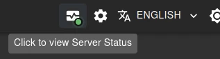
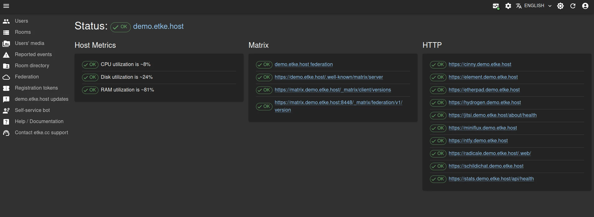
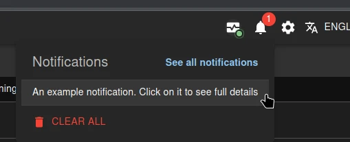
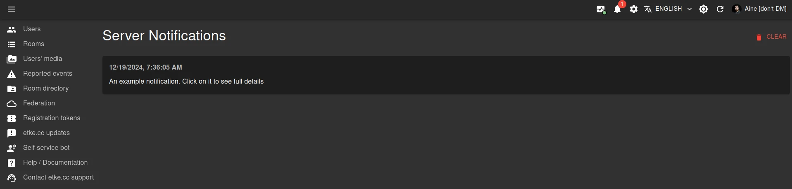

# etke.cc-specific components

This directory contains [etke.cc](https://etke.cc)-specific components, unusable for any other purposes and/or configuration.

We at [etke.cc](https://etke.cc) attempting to develop everything open-source, but some things are too specific to be used by anyone else. This directory contains such components - they are only available for [etke.cc](https://etke.cc) customers.

Due to the specifics mentioned above, these components are documented here rather than in the [docs](../../../docs/README.md), plus they are not supported as part of the Synapse Admin open-source project (i.e.: no issues, no PRs, no support, no requests, etc.).

## Components

### Server Status icon

In the application bar the new monitoring icon is displayed that shows the current server status, and has the following color dot (and tooltip indicators):

* 🟢 (green) - the server is up and running, everything is fine, no issues detected
* 🟡 (yellow) - the server is up and running, but there is a command in progress (likely [maintenance](https://etke.cc/help/extras/scheduler/#maintenance)), so some temporary issues may occur - that's totally fine
* 🔴 (red) - there is at least 1 issue with one of the server's components

### Server Status page

When you click on the [Server Status icon](#server-status-icon) in the application bar, you will be redirected to the
Server Status page. This page contains the following information:

* Overall server status (up/updating/has issues)
* Details about the currently running command (if any)
* Details about the server's components statuses (up/down with error details and suggested actions) by categories

### Server Notifications icon

In the application bar the new notifications icon is displayed that shows the number of unread (not removed) notifications

### Server Notifications page

When you click on a notification from the [Server Notifications icon](#server-notifications-icon)'s list in the application bar, you will be redirected to the Server Notifications page. This page contains the full text of all the notifications you have about your server.
